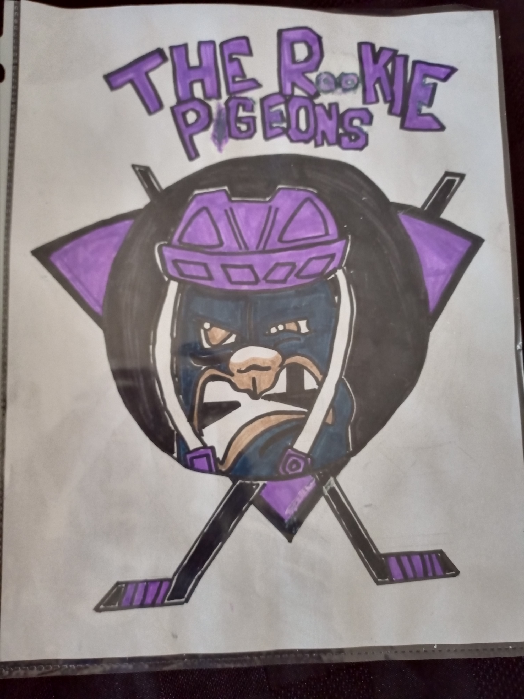

# Pigeons: FLL RePLAY 2020

[Pigeons](https://fll-pigeons.github.io/gamechangers/) are a small community-based [First Lego League](https://www.firstroboticscanada.org/fll/) rookie team, based in London, Ontario.

We will be participating in the [following events](https://www.firstroboticscanada.org/covid-3/):

  * [FIRST LEGO League Challenge Remote Practice Tournament](https://drive.google.com/file/d/1r0kj3WJekACYdHOAu3Z_-qRU7YjFfBcE/view) (Nov29-Dec2):
  * [FIRST LEGO League Challenge Remote Tournament - London (Feb22-Feb24)](https://www.eng.uwo.ca/outreach/first-robotics/lego-league/)
  
  
[Challenge Resources](challenge.md)

### A. [Robot Game](robotgame.md) (14 Missions)

One 2.5 min video recorded remote competition match: [Remote Reffing Guidance](https://info.firstinspires.org/hubfs/Education_Resources/thinkscape/PD/FLL%20Explore%20and%20Challenge/RePLAY%20Remote%20Reffing%20Guidance.pdf)

### B. Presentations:

#### Team Welcome
* Introductory conversation and to attend to any technical requirements (i.e. screen sharing) (2min)

#### 1. [Innovation Project](project.md)
* Presentation (5 min)
* Question and Answer (5 min)
* Research Project Poster

#### 2. [Robot Design](robotDesign.md)
* Explanation (5 min)
* Question and Answer (5 min) 
* [Robot Design Executive Summary (RDES)](IO_RDES.pdf)
* Can we use diagrams showing the robot programs?

#### 3. [Core Values](coreValues.md)
* Reflection (3 min)
* Feedback (5 min)
* ([Core Values Poster](http://flltutorials.com/translations/en-us/CoreValues/CVPoster.pdf) is this required?)

#### Presentation Resources
* [Consolidated judging (new for 2020)](https://firstinspiresst01.blob.core.windows.net/first-game-changers/fll-challenge/Judging-Session-for-Teams.pdf)

# News
> #### 2 July - Team Name selected: Pigeons
> Hockey slang that describes a player that isn’t good enough to score goals by himself, so he picks up the trash of his more skilled linemates. Often used as trash talk, as made famous by Claude Giroux.
