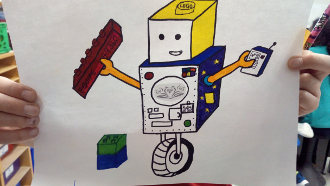

# Équipe #49360 roboHiboux Ligue Lego First - Défi: Ville Avenir 
(École élémentaire Marie-Curie, à London en Ontario.)

Les roboHiboux participent à la compétition [FIRST® LEGO® League (FLL) London](https://www.eng.uwo.ca/outreach/first-robotics/lego-league/) à l'université Western, <b>samedi le 30 Novembre, 2019<b/>.

[Horaire generale (finale)](FLLSchedule2019_General_Schedule.pdf)

[Ressources pour le défi](challenge.md)

## Jour de compétition:
* [Horaire d'équipe](FLLSchedule2019_Team49360.pdf)
* [Liste de contrôle pour Western (checklist)](checklistWestern2019.pdf) (pas de Bluetooth! On doit utiliser une portative)

### A. [Jeu de robot](jeudurobot.md) (14 Missions)

Deux matchs d'entraînement et trois matchs de tournoi de 2.5 min; possibilité d'avoir seulement 5 min entre chaque match!

### B. Présentation devant les juges:
[Fiche d'information de l'équipe](TeamInfoSheet_FL005_Fillable.pdf) (3 copies, une pour chaque présentation)

[Processus de jugement pour Western](CoachesDayPresentation2019_judging.pdf)

#### 1. [Valeurs fondamentales](valeurs.md)
* [Activité d'equipe devant les juges](http://flltutorials.com/translations/en-us/CoreValues/CVJudging.pdf) (5 min)
* Question et réponses (10 min)

([Affiche des valeurs fondamentales](http://flltutorials.com/translations/en-us/CoreValues/CVPoster.pdf) est non requis a Western)

#### 2. ~~[Projet de recherche](projet.md)~~ (on ne fait pas le projet - pas assez de temps)
* ~~Présentation (5 min - inclus le temps pour s'installer)~~
* ~~Question et réponses (10 min)~~
* ~~Affiche du projet de recherche~~

#### 3. [Conception de robot](robotDesign.md)
* ~~Présentation du résumé de conception de robot (4 min)~~
* Question et réponses (15 min) (nous avons accès à une table de pratique avec un ensemble de défis à Western)
* ~~[Résumé de conception de robot (RDES)](https://drive.google.com/file/d/1VC3oS6zkFRucYmjoOFKwcpcF8nQUieVT/view)~~ (on ne fait pas ce document - pas assez de temps)
* Diagrams demontrant le programme du robot (sur papier or ordinateur) 

#### [Roles](roles.md)

#### [Autres Liens](liens.md)

# Nouvelles 
> #### 6 Dec - [Images de la compétition](https://www.facebook.com/pg/westernuEng/photos/?tab=album&album_id=539192496663259)

> #### 2 Dec - Resultats
> * [Tableau de bord](https://www.flltournament.com/Scoreboard.aspx?TID=22020)

> #### 19 Nov - clarification de la Mission 11 Architecture innovante
> * Bien que vous avez permission de compléter <b>Mission 13 Rénovation Durable</b> et <b>Mission 11 Architecture Innovante</b> en même temps que <b>Mission 12 Conception et construction</b>, Mission 11 ne doit pas etre en contact avec Mission 12 et les équipes risquent de perdre des points si elles ne respectent pas la règle de non-contact.

> #### 15 Nov - Programmes sur Github
> * Nos programmes EV3 sont maintenant sauvegardés sur [Github](https://github.com/roboHiboux/villeavenir/tree/master/programmes)

> #### 11 Nov - Logiciels gratuits discuté en classe aujourd'hui
> * [Virtual Robotics Toolkit (VRT)](https://www.firstroboticscanada.org/cancode/vrt/) (pratiquer la programmation EV3 sur un tapis de jeu virtuel)
> * [LEGO MINDSTORMS Education EV3](https://education.lego.com/en-us/downloads/mindstorms-ev3/software) (logicielle qu'on utilise à l'école)

> #### 11 Nov - Exemples de questions.
> * [Conception de robot](https://github.com/roboHiboux/villeavenir/blob/master/docs/2-InterviewSampleQuestions-RobotDesign-Rick.pdf)
> * [Valeurs fondamentales](https://github.com/roboHiboux/villeavenir/blob/master/docs/2a-InterviewSampleQuestions-CoreValues-Rick.pdf)

> #### 11 Nov - Aperçu détaillé du jeu de robot.
> * [FLL Ask the Referee North Bay And Sudbury 2019](https://www.youtube.com/watch?v=YcbfksBt4sE&feature=youtu.be)

> #### 9 Nov - Mission Grue - Information additionelles:
> * [Crane Mission Guidance - blog post](http://flltutorials.com/translations/en-us/Worksheets/CraneMissionTipsAppVersion.pdf)
> * [Solution Sanjay & Arvind Seshan](http://flltutorials.com/translations/en-us/Worksheets/CraneMissionTipsFullVersion.pdf)

> #### 6 Nov - Document FLL: ["CONSENT AND RELEASE AGREEMENT"](https://www.firstinspires.org/sites/default/files/uploads/2017-2018%20CONSENT%20AND%20RELEASE%20AGREEMENT%20ENGLISH.pdf)
> * Madame Elizabeth à envoyée ce document avec les enfants.  Ce document est obligatoire pour participer à la compétition à western.  S.V.P. signer et retourner à l'école.

> #### 4 Nov - Projet de recherche
> * on commence a trouver un [problème](projet.md) a resoudre

> #### 2 Nov - videos de M. Hino: [LEGORobotics](https://www.youtube.com/channel/UCvuw_UluXNRPKhqK5GU8SrQ/videos)
> * [erreur avec drone](https://www.youtube.com/watch?v=-bktRKjIdIE)

> #### 2 Nov - videos de M. Hino: [LEGORobotics](https://www.youtube.com/channel/UCvuw_UluXNRPKhqK5GU8SrQ/videos)
> * [5 missions séparées](https://www.youtube.com/watch?v=dAlKqZBOkeo)
> * [3 missions combinées](https://www.youtube.com/watch?v=gxRV948MMsE)
