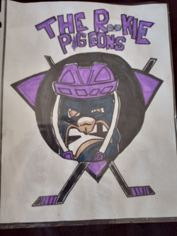

# Team 50697 - Pigeons First Lego League Challenge - Game Changers 2020

The [Pigeons](https://fll-pigeons.github.io/gamechangers/) community team (team #50697), based in London, Ontario, is participating at the [FIRST® LEGO® League (FLL) Challenge competition](https://www.eng.uwo.ca/outreach/first-robotics/lego-league/) at the University of Western in late November or early December, 2020.

[2019 Competition Schedule (TBD)](FLLSchedule2019_General_Schedule.pdf)

[Challenge Resources](challenge.md)

### Day of Competition
* [2019 Team Schedule (TBD)](FLLSchedule2019_Team49360.pdf)
* [Checklist](checklistWestern2019.pdf) (no Bluetooth allowed!)

### A. [Robot Game](robotgame.md) (14 Missions)

Two training matches and three competition matches of 2.5 min each; possibility of only having 5 min between each match!

### B. Presentations:
[Team Information Sheet](TeamInfoSheet_FL005_Fillable.pdf) (3 copies, one for each presentation)

[Western Judging Process - 2019](CoachesDayPresentation2019_judging.pdf)

[Consolidated judging (new for 2020)](https://firstinspiresst01.blob.core.windows.net/first-game-changers/fll-challenge/Judging-Session-for-Teams.pdf)
#### Team Welcome
* Introductory conversation as team sets up any materials they have brought (2min)

#### 1. [Innovation Project](projet.md)
* Presentation (5 min)
* Question and Answer (5 min)
* Research Project Poster

#### 2. [Robot Design](robotDesign.md)
* Explanation (5 min) (do we have access to a practice table with Challenge set?)
* Question and Answer (5 min) 
* [Robot Design Executive Summary (RDES)](IO_RDES.pdf)
* Can we use diagrams showing the robot programs

#### 3. [Core Values](coreValues.md)
* ~~[Team activity before the judges](http://flltutorials.com/translations/en-us/CoreValues/CVJudging.pdf) (5 min)~~
* Reflection (3 min)
* Feedback (5 min)
* ([Core Values Poster](http://flltutorials.com/translations/en-us/CoreValues/CVPoster.pdf) is this required?)

#### [Other Links](links.md)

# News
> #### 2 July - Team Name selected: Pigeons
> Hockey slang that describes a player that isn’t good enough to score goals by himself, so he picks up the trash of his more skilled linemates. Often used as trash talk, as made famous by Claude Giroux.
