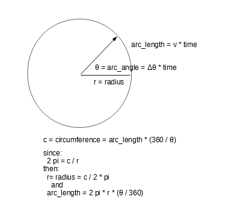

## Problem Statement: 

Want to be able to navigate around a wall or object by only giving the distance the brick is from the wall or object.

The function would use the distance parameter as the radius of an imaginary circle that would direct the robot to travel 
in a half circle around the wall or object.

Therefore, given the radius as a parameter, the function calculates the 'turning rate' and the distance the robot
needs to travel (i.e. 'arc length' on the imaginary circle) to get the robot around a wall or object.  All you 
do is get the robot to the point of turning, give the distance to the object you want to avoid, and it travels 
in a half circle using the distance given as the radius.

## Solution:


Big thank you to Liam MacLean (FRC [team 5483 GD-Bots](https://github.com/Team-5483) alumnus) for working-out most of the math for this tutorial.

The solution requires simple arc math with the [drive(drive_speed, turn_rate)](https://pybricks.github.io/ev3-micropython/robotics.html#pybricks.robotics.DriveBase.drive) function,

given: 
  * v = velocity ; and 
    * (note: velocity is not the same as speed... velocity has magnitude and direction; whereas speed only has magnitude)
  * Δθ = turn_rate 
    * (Δθ is pronounced delta theta)
  
then:  
  * arc_length = v * time
  * arc_angle = Δθ * time

circumference = arc_length * (360/arc_angle)  #For example, if arc_angle is 360, then the circumference of the circle is just arc_length

radius = circumference/ 2*pi

therefore

radius = ((v * time) * (360/( Δθ * time)) ) / 2*pi

cancel out time

## Final formula
  * radius
    * r = 360v / ( Δθ * 2 * pi)

## which can be rearranged as

  * velocity
    * v = (r *  Δθ * 2 * pi) / 360 = (r *  Δθ * pi) / 180
or

  * turn_rate
    * Δθ = 360v / r * 2 pi = **180 * v / r * pi**

So you can make a function that takes as input 2 of either speed, radius, degrees/second and spits out the other one.

I assume you would want to input speed and radius and receive turning rate, so use the last equation.

## Pi
  *  pi is a mathematical constant (3.14...), defined as the ratio of a circle's circumference to its diameter:
     * pi = circumference / diameter 
     then
     * c = circumference = diameter * pi
       * since: r = radius = 2 * d
       * then:  2 pi = c / r

  * arc_length is proportional to the arc_angle, therefore if if arc_angle is 360, then arc_length is 
    circumference of entire circle (i.e.`2 pi * r`)
    * θ = arc_angle
    * arc_length = **2 pi * r * (θ / 360)**
  
## radiusTurnMotorDistance:

```
# v = drive_speed
# r = radius
# θ = turn_angle (which corresponds to how far around the circumference of the imaginary circle, 
# of radius r, you want robot to travel)

def radiusTurnMotorDistance(radius, drive_speed=200, turn_angle=180):
    turn_rate = (180 * drive_speed) / (radius * math.pi)
    arc_length = 2 * math.pi * radius * (turn_angle / 360)

    robot.reset()      
    while robot.distance() < arc_length:
        robot.drive(speed=drive_speed, turn_rate=turn_rate)
```

See [radiusTurnApproaches.py](/programs/radiusTurnApproaches.py) for additional approaches using robot.angle() or gyro.angle()

