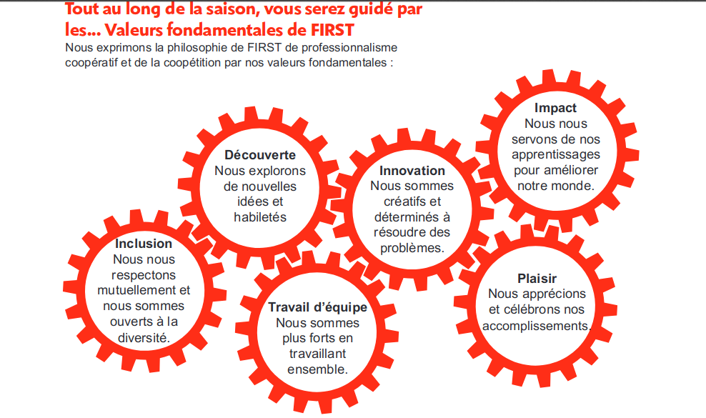

# Valeurs fondamentales

# 1. Description

# 2. Sessions de jugement Western

## The following outlines what you can expect in each of the judging sessions.
### Core Values Judging

Your team will spend fifteen (15) minutes with the judges. During the first five (5) minutes, your team will be
given a surprise teamwork activity to complete in front of the judges. The judges will be looking for evidence of
your team dynamics: How well does your team communicate? Do they respect each other? Do they
incorporate each other’s ideas into the solution? Does your team have leaders? Do they incorporate elements
of Gracious Professionalism ® in the way they communicate with each other? Are they able to solve the problem
and complete the task?
The final ten (10) minutes are reserved for the judges to ask the team questions about the activity and/or the
season.

# [Rubric des juges](rubricsValues.pdf)

## What is Gracious Professionalism ® ?

Gracious Professionalism ® is part of the ethos of FIRST ® . The idea and phrase are found throughout FIRST, but
no one has been a stronger champion than FIRST Executive Advisory Board Co-Chair & Distinguished Advisor,
Dr. Woodie Flowers. “Gracious Professionalism is a way of doing things that encourages high-quality work,
emphasizes the value of others, and respects individuals and the community. With Gracious Professionalism,
fierce competition and mutual gain are not separate notions. Gracious Professionals learn and compete like
crazy but treat one another with respect and kindness in the process.”

We expect all team members, volunteers, coaches, and families to behave as Gracious Professionals.

# 3. [Exemples de questions](2a-InterviewSampleQuestions-CoreValues-Rick.pdf)

# 4. tutoriels
* [Activités d'équipe et de valeurs fondamentals](http://archive.ev3lessons.com/web/ev3lessons-v4.9.0/corevalues.html) (ev3lessons)
* [valeurs fondamentals](http://flltutorials.com/CoreValues.html) (flltutorials)
* [FLLTutorials](http://flltutorials.com/CoreValues.html)
    * [Introduction aux valeurs fondamentales](http://flltutorials.com/translations/en-us/CoreValues/IntroductiontoCV.pdf)
    * [échantillon d'affiche des valeurs fondamentales](http://flltutorials.com/translations/en-us/CoreValues/CVPoster.pdf)
    * [Comment prendre des décisions](http://flltutorials.com/translations/en-us/CoreValues/MakingDecisions.pdf)
